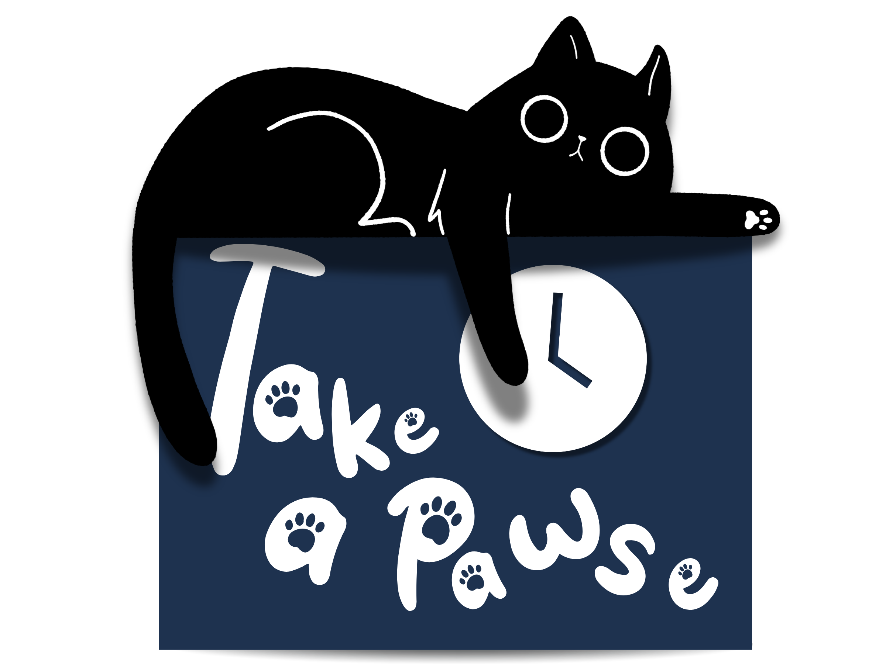
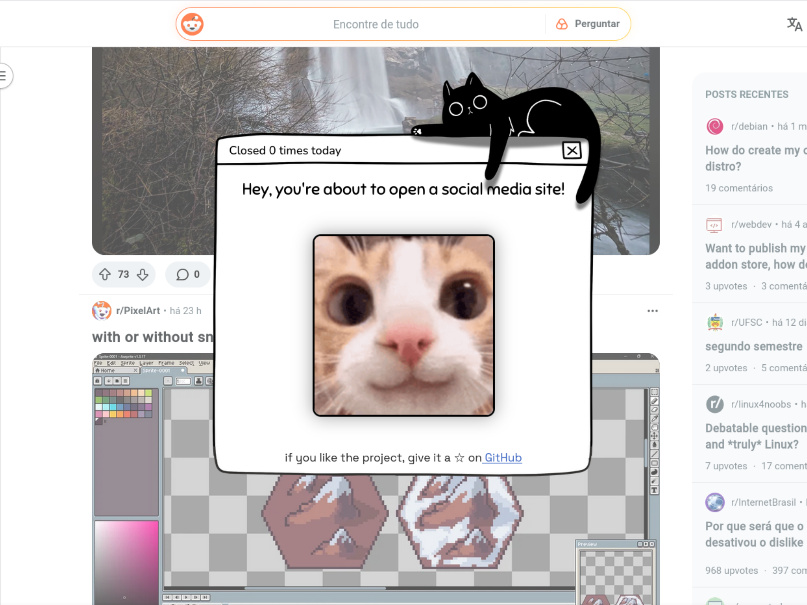

# 😽 Take a Pawse, a Firefox extension that helps to reduce mindless scrolling

In a time when social media often takes control of our attention, and even our time, this Firefox extension aims to gently remind users when they’re about to open a social media site. It displays a kitten reaction every time a “suspect” URL is accessed. Each time the user closes the pop-up by clicking the “X,” the cat’s reaction changes; the more you dismiss it, the more annoyed the cats become…

The extension also includes a control panel that lets users customize their experience. You can choose which URLs trigger the pop-up and select your preferred language. Currently, it supports four languages: English, Portuguese, Spanish, and French. If your language isn’t available and you’re able to translate from one of the supported languages, feel free to contribute by adding it to the GitHub repository.

There’s also an optional timer feature that prevents the pop-up from being closed until a set amount of time has passed; helping you pause, breathe, and think twice before diving in.
